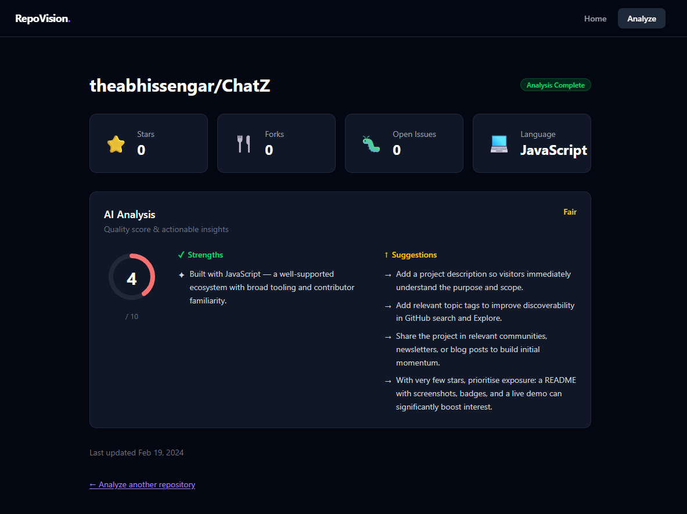

# RepoVision


> An AI-powered GitHub repository analyzer that evaluates open-source repositories and provides insights such as repository stats, quality score, strengths, and improvement suggestions.

[](https://repovision.vercel.app)
[](https://repovision-api.onrender.com)

---

## Live Demo

**Frontend:** [https://repovision.vercel.app](https://repovision.vercel.app)  
**Backend API:** [https://repovision-api.onrender.com](https://repovision-api.onrender.com)

---

## Why This Project

RepoVision was built to demonstrate a complete full-stack JavaScript workflow from data fetching to AI-driven evaluation:

- **Full-stack JavaScript architecture** — a single language across the entire stack
- **React + Vite frontend** deployed on Vercel as a fast, static SPA
- **Node.js + Express backend** deployed on Render as a scalable web service
- **GitHub API integration** for real-time repository data fetching
- **AI-based repository evaluation logic** that scores repos and surfaces actionable insights

---

## Features

- Analyze any public GitHub repository by URL or `owner/repo` slug
- Repository stats — stars, forks, watchers, open issues, language, license
- AI-generated quality score based on repository health indicators
- Identified strengths and areas for improvement
- Clean, responsive dashboard to browse analysis results
- Fast async processing with job-based result polling

---

## Tech Stack

| Layer    | Technology                          |
|----------|-------------------------------------|
| Frontend | React, Vite, Tailwind CSS           |
| Backend  | Node.js, Express                    |
| Data     | GitHub REST API                     |
| Hosting  | Vercel (frontend), Render (backend) |

---

## Architecture

```
+----------------------------------------------------------+
|                         Client                           |
|               React + Vite  (Vercel)                     |
|                                                          |
|   HomePage  ->  AnalyzePage  ->  DashboardPage           |
+------------------------+---------------------------------+
                         | HTTP (REST)
                         v
+----------------------------------------------------------+
|                         Server                           |
|               Node.js + Express  (Render)                |
|                                                          |
|              POST /api/analyze                           |
+------------------------+---------------------------------+
                         |
                         v
                   GitHub REST API
```

- **Frontend** is deployed on [Vercel](https://vercel.com) as a static SPA.
- **Backend** is deployed on [Render](https://render.com) as a Node.js web service.
- The backend fetches repository data from the **GitHub API**, processes it, and returns structured analysis results to the client.

---

## Project Structure

```
repovision/
├── client/         # React + Vite frontend
├── server/         # Express API backend
├── screenshots/    # README images
└── README.md
```

---

## Installation

### Prerequisites

- Node.js v18+
- npm or yarn
- A GitHub personal access token (for higher API rate limits)

### Clone the repository

```bash
git clone https://github.com/theabhissengar/repovision.git
cd repovision
```

### Install dependencies

```bash
# Install server dependencies
cd server
npm install

# Install client dependencies
cd ../client
npm install
```

### Run locally

```bash
# In the server directory
cd server
npm run dev

# In the client directory (separate terminal)
cd client
npm run dev
```

The client will be available at `http://localhost:5173` and the server at `http://localhost:3000`.

---

## Environment Variables

### Server (`server/.env`)

```env
PORT=3000
GITHUB_TOKEN=your_github_personal_access_token
```

### Client (`client/.env`)

```env
# Local development
VITE_API_URL=http://localhost:3000/api

# Production
VITE_API_URL=https://repovision-api.onrender.com/api
```

---

## API Endpoints

| Method | Endpoint        | Description                      |
|--------|-----------------|----------------------------------|
| `POST` | `/api/analyze`  | Submit a repository for analysis |

### Example Request

```bash
curl -X POST https://repovision-api.onrender.com/api/analyze \
  -H "Content-Type: application/json" \
  -d '{ "repo": "facebook/react" }'
```

### Example Response

```json
{
  "repo": "facebook/react",
  "stats": {
    "stars": 228000,
    "forks": 46000,
    "openIssues": 750,
    "language": "JavaScript",
    "license": "MIT"
  },
  "qualityScore": 94,
  "strengths": ["Active maintenance", "Comprehensive documentation", "Large community"],
  "improvements": ["Reduce open issue backlog"]
}
```

---

## Deployment

### Frontend — Vercel

1. Push the `client` folder (or monorepo root) to GitHub.
2. Import the project in [Vercel](https://vercel.com/new).
3. Set **Framework Preset** to `Vite`.
4. Set the **Root Directory** to `client`.
5. Add the `VITE_API_URL` environment variable pointing to your Render backend.
6. Deploy.

### Backend — Render

1. Push the `server` folder to GitHub.
2. Create a new **Web Service** on [Render](https://render.com).
3. Set **Root Directory** to `server`.
4. Set **Build Command** to `npm install` and **Start Command** to `npm start`.
5. Add the `GITHUB_TOKEN` environment variable in the Render dashboard.
6. Deploy.

---

## Screenshots

### Repository Analysis Dashboard



---

## Future Improvements

- [ ] Authentication — save and revisit past analyses
- [ ] Compare two repositories side-by-side
- [ ] Trend graphs for stars, forks, and issues over time
- [ ] Support for GitLab and Bitbucket repositories
- [ ] Shareable analysis report links
- [ ] Dark / light theme toggle
- [ ] Rate limit feedback and queue status indicator

---

## License

This project is open source and available under the [MIT License](LICENSE).

---

## Author

**Abhishek Singh Sengar**  
GitHub: [https://github.com/theabhissengar](https://github.com/theabhissengar)
